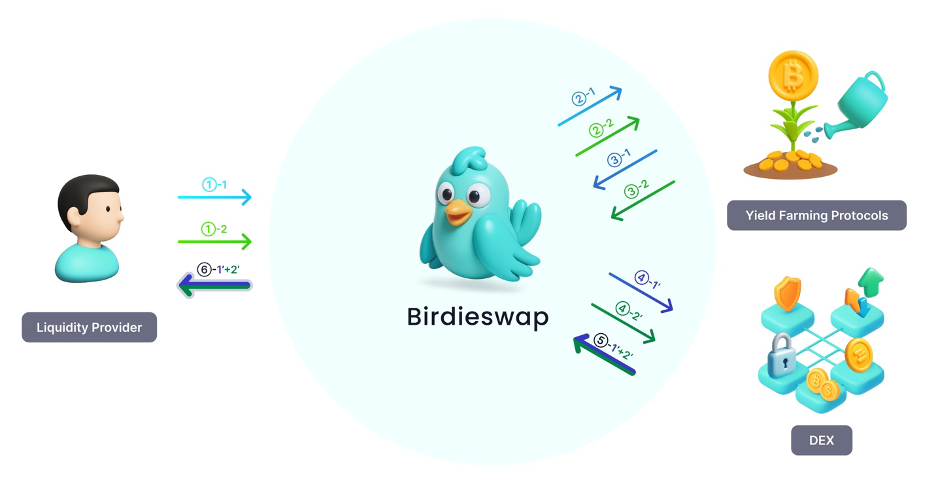
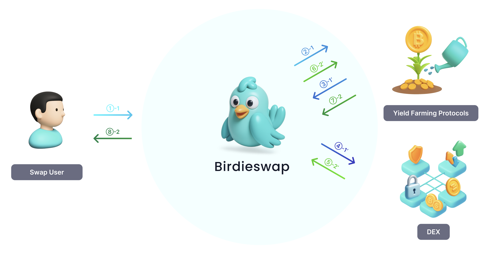

# Introducing Birdieswap

#### _Swap like any DEX. Earn like two._ _Birdieswap turns yield-bearing deposits into trade-ready liquidity—so LPs earn deposit yield + trading fees, and traders swap with zero extra steps._

## **Provide Liquidity – Capital That Works Twice**

**Dual Yield, One Move**

Birdieswap lets liquidity providers earn two revenue streams from the same capital —\
deposit yields from integrated yield protocols and trading fees from AMM swaps.

Dual yield means your liquidity earns from _two distinct sources_:

* Deposit Yield: Earnings from integrated protocols such as Autopilot, Aave, or Lido.
* Trading Fees: Fees collected from AMM swaps using Proof Tokens as liquidity pairs.

This makes every deposit capital-efficient — earning like a vault, functioning like an AMM.

_\* Currently, Birdieswap integrates Autopilot for yield strategies and Uniswap for AMM swaps._

**Auto-Compounding Engine**

All rewards from deposits and swaps are automatically harvested and reinvested.\
This mechanism compounds yield continuously, growing both LP returns and overall pool liquidity.

**How it works (LP flow):**

1. Add liquidity to a curated pool (e.g., bUSDC–bWBTC).
2. Birdieswap standardizes receipt tokens as btokens (our wrapper) so they behave like normal ERC-20s in the pool.
3. Your position now accrues vault yield + swap fees automatically.

<figure><figcaption></figcaption></figure>

## Swap — Same UX, Smarter Liquidity

**A Seamless Swap Experience**

Birdieswap delivers a DEX-like experience — users swap as if they were using native tokens.\
All Proof Token conversions happen automatically behind the scenes through the router.\
No wrapping, no extra clicks — just simple, efficient swaps.

* Trade using native tokens — no technical complexity.
* Familiar interface and flow, identical to major DEXs.
* Fully non-custodial and gas-optimized routing.

**Curated Pairs, Smarter Liquidity**

Birdieswap only lists curated token pairs that meet internal standards for liquidity depth, protocol stability, and fee reliability.\
This selective approach ensures higher-quality trading environments for users.\
Meanwhile, auto-compounding mechanics continually expand these pools, strengthening liquidity over time.

* Access to pre-vetted, high-quality trading pairs.
* Deeper liquidity → lower slippage and better execution.
* Liquidity continuously grows through automatic reinvestment.

**How it works (trader flow):**&#x20;

<figure><figcaption></figcaption></figure>

## Why Birdieswap is different

|   Traditional DEX  |                     Birdieswap                    |
| :----------------: | :-----------------------------------------------: |
|   Idle Liquidity   |     Productive Liquidity (keeps earning yield)    |
| Native tokens only | Yield-bearing assets trade natively (via bTokens) |
|    Fragmented UX   |    One-click swaps; router hides all complexity   |
|      Fees only     |        Dual yield; vault growth + AMM fees        |

## Curated Pools, Healthier Markets

We list pre-vetted pairs that meet our bars for liquidity depth, vault stability, and fee transparency.\
Auto-compounding strengthens those pools over time → deeper books, lower slippage, better execution.

