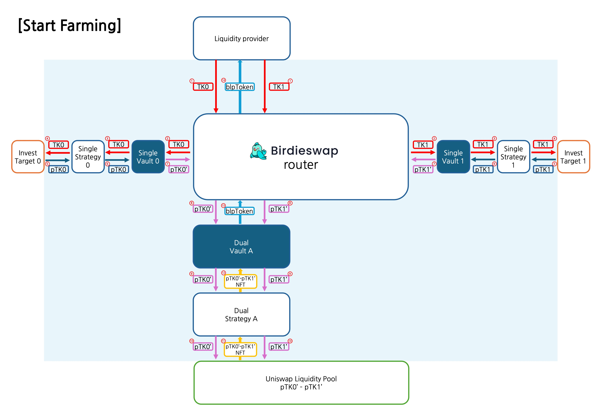

# Farming

## Pair Token(LP) Farming

Pair Token(LP) Farming is similar to supplying liquidity to a traditional DEX; however, Birdieswap employs a slightly different method for forming the pair.

<figure><figcaption></figcaption></figure>

1. The user selects a Pair Token Pool from the Pool List and enters the deposit amounts for each token, then clicks the “Start Farming” button.
2. The wallet prompts for transaction approval as in a typical DEX operation.
3. The two tokens forming the pair are individually deposited into their corresponding protocol pools through the internal Single Token Vaults, each receiving its own receipt token.
4. These receipt tokens are automatically stored and processed to issue Birdieswap receipt tokens, analogous to the Single Token Farming process.
5. The two Birdieswap receipt tokens are then paired in the designated Pair Token Vault and supplied as liquidity to the DEX, using predetermined parameters for the liquidity range and fee rate.
6. The LP tokens received from the DEX are likewise automatically farmed, and corresponding Birdieswap LP tokens are issued to the user, completing the liquidity supply process.
7. Subsequently, Birdieswap uses the ownership of the stored receipt tokens to automatically farm both the individual Single Token yields and the Pair Token trading fee income, thereby compounding the benefits for the user.

<figure><figcaption></figcaption></figure>

8. To exit the farming process, the user selects “Stop Farming” and approves the corresponding withdrawal transactions via their wallet.
