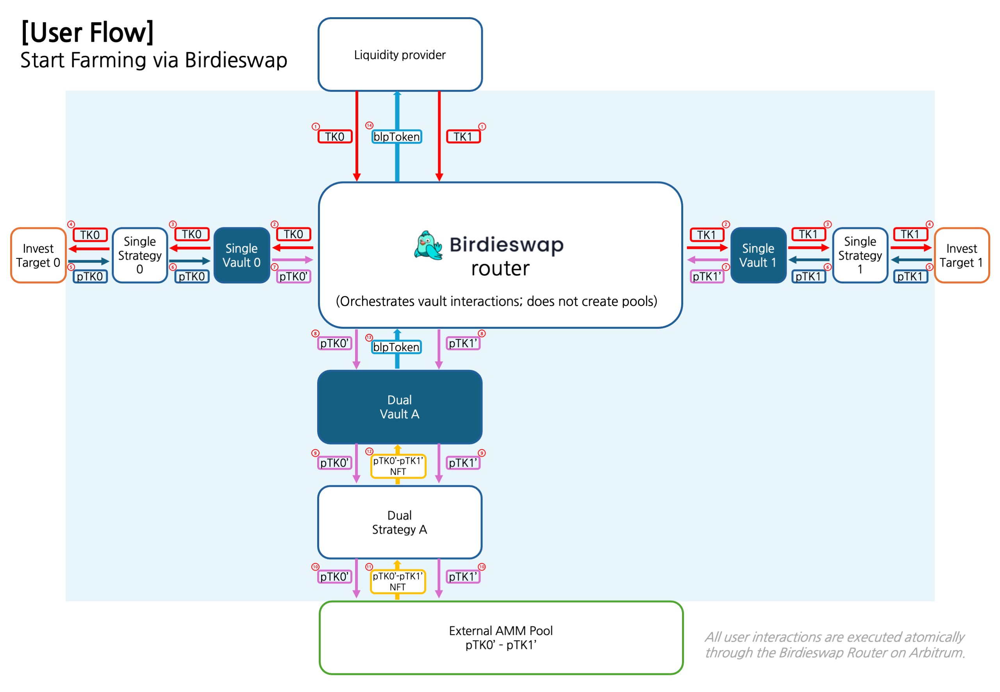
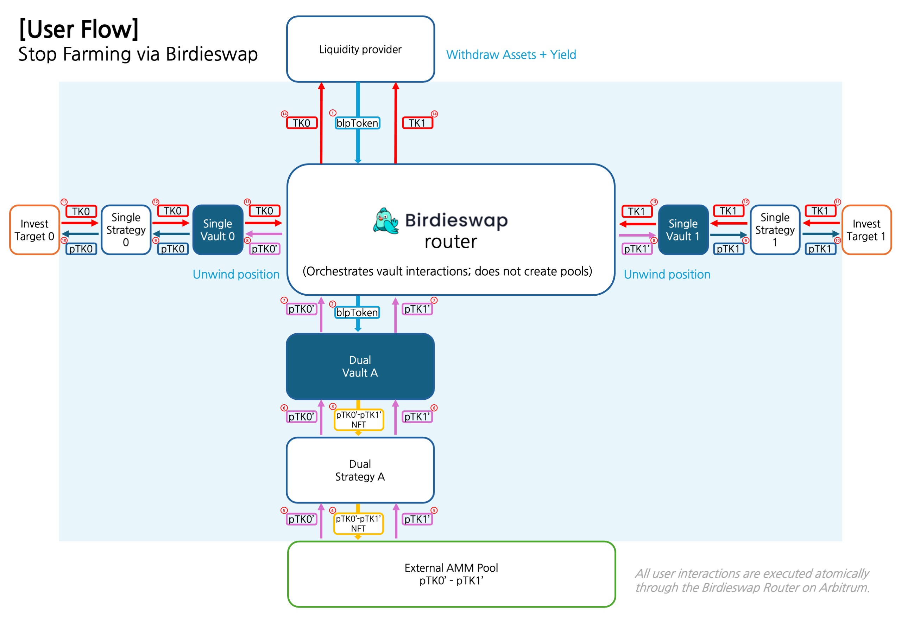
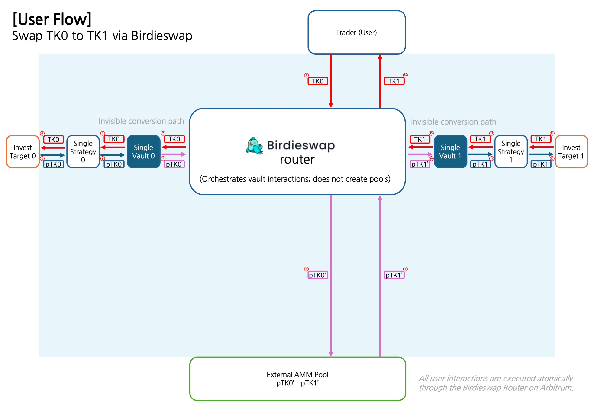

# Router Flow & Diagrams

## Liquidity Provisioning

The Liquidity Provision service provided by Birdieswap is not an independently operated AMM or vault.\
Rather, it orchestrates deposits into rigorously vetted yield protocols and pairs the resulting **receipt tokens (Proof Tokens)** as liquidity on a vetted DEX via the Birdieswap router. As with conventional AMMs, the provider must supply the tokens required by the target pair.

Under a conventional flow, an LP would first acquire each side’s receipt token by depositing base assets into the respective underlying protocols, then contribute those receipt tokens as an AMM pair—managing multiple approvals, conversions, and accounting details along the way.

To simplify this process, Birdieswap offers the **Birdieswap router**.

<figure><figcaption></figcaption></figure>

<figure><figcaption></figcaption></figure>

1. The user selects a Pair Token Pool from the Pool List and enters the deposit amounts for each token, then clicks the “Start Farming” button.
2. The wallet prompts for transaction approval as in a typical DEX operation.
3. The two tokens forming the pair are individually deposited into their corresponding protocol pools through the internal Single Token Vaults, each receiving its own receipt token.
4. These receipt tokens are automatically stored and processed to issue Birdieswap receipt tokens, analogous to the Single Token Farming process.
5. The two Birdieswap receipt tokens are then paired in the designated Pair Token Vault and supplied as liquidity to the DEX, using predetermined parameters for the liquidity range and fee rate.
6. The LP tokens received from the DEX are likewise automatically farmed, and corresponding Birdieswap LP tokens are issued to the user, completing the liquidity supply process.
7. Subsequently, Birdieswap uses the ownership of the stored receipt tokens to automatically farm both the individual Single Token yields and the Pair Token trading fee income, thereby compounding the benefits for the user.

## Swap

The Swap service provided by Birdieswap is not an independently operated AMM DEX. Rather, it leverages liquidity supplied via the Birdieswap router to conduct transactions on a rigorously vetted DEX. However, as with conventional AMMs, the user must hold tokens that are paired for the swap.

Since liquidity supplied through Birdieswap consists of receipt tokens obtained from depositing assets into an underlying protocol, a swap would conventionally require that the user obtains the corresponding receipt tokens from that same protocol.

To simplify this complex process, Birdieswap offers the Birdieswap router.

<figure><figcaption></figcaption></figure>

1. Through a virtual DEX interface provided by Birdieswap, the user selects the token they hold and the desired token to receive, then enters the swap amount. From the user’s perspective, both the token being exchanged and the token received are native tokens.
2. As with any conventional DEX (such as Uniswap), the user first authorizes the token usage.
3. Once the authorization is complete, the Swap button is activated. For explanatory purposes, let us denote the token held by the user as Token1 and the token to be received as Token2.
4. The Swap Module accepts Token1 and deposits it via the corresponding Single Token Vault (Vault1) into the underlying protocol’s Token1 pool, receiving a receipt token (Receipt Token1) and issuing a corresponding Birdieswap receipt token.
5. The Birdieswap receipt token for Token1 is then exchanged within the liquidity pool for the Birdieswap receipt token corresponding to Token2.
6. This exchanged Birdieswap receipt token is then converted back (via the appropriate Single Token Vault, Vault2) into Receipt Token2, which is subsequently redeemed from the underlying protocol’s Token2 pool as Native Token2.
7. Native Token2 is finally transferred to the user, completing the swap process.
8. The user can then verify the received amount of Token2 in their connected wallet.

Though the process is complex, Birdieswap’s automation ensures that the only manual steps are the initial configuration, token approval, and the final button click—keeping the overall user experience straightforward and user-friendly.

